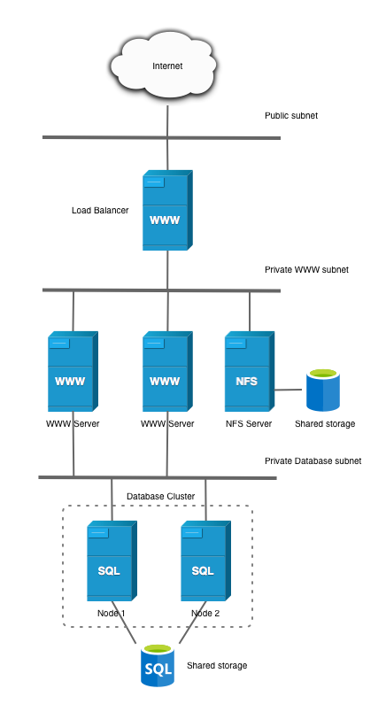

# Practica01-11IAW
Este repositorio es para la Práctica 1 apartado 11 de IAW


## Introducción, ¿Que tenemos que hacer?

- En esta práctica vamos a ver como implementar *_WordPress_* en una arquitectura de tres niveles y añadiendo una máquina nueva llamada *_NFS_SERVER_*.


    En el servidor *_NFS_* almacenaremos los directorios de *_Apache2_* los cuales son `/var/www/html` en un mismo servidor. Para esto más adelante haremos una serie de *_scripts_* de instalación tanto para el cliente como para el servidor.

    La imagen de esta arquitectura se representa de la siguiente manera:

    

    Asi mismo, tendremos que tener un orden de carpetas para poder almacenar la configuración correspondiente de la práctica.

    El orden será el siguiente: 

    1. `Carpeta conf` --> `000-default.conf / load-balancer.conf` 
    2. `Carpeta Exports` --> Que almacenerá una linea que modificaremos en un script para su correcta configuración de ip :  `/var/www/html NFS_FRONTEND_NETWORK(rw,sync,no_root_squash,no_subtree_check)` Realmente es una plantilla que nosotros creamos para poder modificarlo más adelante para remplazarlo por una variable, aunque realmente, es un archivo `.txt`
    3. `Carpeta htacces` --> Tendrá en su interior nuestro archivo `.htacces` que anteriormente hemos configurado en otras prácticas.
    4. `Carpeta php` --> Carpeta que tiene en su interior el archivo `index.php`
    5. `Carpeta Scripts` --> Carpeta principal que almacenará todos los *_scripts_* que deberemos ir lanzando dentro de cada máquina.
    6. `Carpeta images` --> Carpeta opcional mía donde almacenaré imagenes de la práctica.


### Apunte antes de empezar con la explicación

- Esta práctica ha sido revisada anteiormente por JJ en clase, por lo tanto las máquinas que utilicé para su correspondiente instalación estan borradas por falta de espacio en *_AWS_* , aun así realizaré la explicación de todos los scrips de manera individual y diviendo la práctica en diferentes fases.

    1. Fase 0 : Instalación de WordPress en un nivel ( Un único servidor con todo lo necesario ) Lo que quiere decir en un solo *_FRONT_END_*


    2. Fase 1: Instalación de WordPress en dos niveles ( Un servidor Web y un servidor MySQL)

    3. Fase 2: Instalación de WordPress a tres niveles ( Balanceador, 2 Servidores Web, Servidor NFS y Servidor MYSQL) 

- La fase 2 será la que utilicemos en esta práctica, los anteriores han sido lo que hemos ido realizando en prácticas anteriores como pueden ser [Practica 1-10 de IAW](https://github.com/kinoibanez/Practica01-10IAW) 


## Estructura de los archivos.

- La estructura de los archivos será la siguiente, siguiendo el orden de directorios ue comentamos anteriormente:

    


# Carpetas con archivos de configuración.

- La primera carpeta que contiene una serie de archivos de configuración es nuestra carpeta *_conf_*. 

    Esta carpeta tiene en su interior nuestro archivo *_000-default.conf_* que como sabemos se almacena en `etc/apache2/sites-availables`

    Y tendrá el siguiente contenido: 
    ```
        <VirtualHost *:80>
    #ServerName www.example.com
    ServerAdmin webmaster@localhost
    DocumentRoot /var/www/html
    DirectoryIndex index.php index.html
    <Directory "/var/www/html">
        AllowOverride All
    </Directory>

    ErrorLog ${APACHE_LOG_DIR}/error.log
    CustomLog ${APACHE_LOG_DIR}/access.log combined
    </VirtualHost>
        
    ```

- El siguiente archivo que encontramos dentro de esta carpeta es el archivo de configuración del balanceador. El cual tiene el siguiente contenido: 

    ```
    <VirtualHost *:80>
        <Proxy balancer://mycluster>
            # Server 1
            BalancerMember http://IP_HTTP_SERVER_1

            # Server 2
            BalancerMember http://IP_HTTP_SERVER_2
        </Proxy>

        ProxyPass / balancer://mycluster/
    </VirtualHost>

    ```

    Aquí podemos observar como en este archivo de configuración declaramos los *_miembros_* que van a ser utilizado en nuestro valanceador.

    Las variables *_IP_HTTP_SERVER__* son variables que nosotros hemos declaro en nuestro archivo `.env` que contiene la IP privada de cada uno de los servidores que queremos que se usen en el balanceador.

    


### Carpeta *_Exports_*

- El contenido de la carpeta Exports contiene la siguiente linea: 

    ```
    /var/www/html NFS_FRONTEND_NETWORK(rw,sync,no_root_squash,no_subtree_check)
    ```

    Este archivo será el encargado de contener la configuración de la exportación del directorio en un servidor NFS SERVER.

    Encontramos una serie de parámetros, la explicación de ellos es la siguiente:

    1. `rw: permite lectura y escritura`
    2. `sync: Los cambios en el sistema de archivos se sincronizan`
    3. `no_root_squash: Permite que el usuario *root* tenga los mismos permisos en ambos lados, tanto cliente/servidor`
    4. `no_subtree_check: Desactiva la comprobación del subarbol para mejorar el rendimiento con archivos bastante grandes`

    Realmente la funcionalidad de esta carpeta es compartir todo esto en el directorio `var/www/html` del servidor en cuestión

    Nuestra variable que va en la linea de código estará configurada en nuestro archivo `.env`

    

### Carpeta *_htacces_* 

- Como en prácticas anteriores esta carpeta contiene una serie de sentencias que lo que hacen es declarar una serie de reglas en nuestro servidor. Las reglas que encontramos pueden ser:

    1. `RewriteEngine ON: Habilita el motor de reescritura`
    2. `RewriteBase /: Define la URL`
    3. `RewriteRule ^index\.php$ : Indica que si alguien accede directamente a index.php no se realizará ninguna manipulación de datos`
    4. `RewriteCond %{REQUEST_FILENAME} !-f: Verifica si existe el archivo que solicitamos `
    5. `RewriteCond %{REQUEST_FILENAME} !-d: Igual que la anterior, pero verifica si el directorio solicitado es correcto`
    6. `RewriteRule . /index.php [L]: Si el archivo que estamos solicitando no pertenece a nada, reenvia todas las solicitudes a index.php`

    El contenido en este caso de nuestro archivo dentro de esta carpeta es el siguiente:

    ```
    # BEGIN WordPress
    <IfModule mod_rewrite.c>
    RewriteEngine On
    RewriteBase /
    RewriteRule ^index\.php$ - [L]
    RewriteCond %{REQUEST_FILENAME} !-f
    RewriteCond %{REQUEST_FILENAME} !-d
    RewriteRule . /index.php [L]
    </IfModule>
    # END WordPress

    ```
### Carpeta *_php_*

- Esta carpeta unicamente contiene un *_index.php_* por lo tanto no merece explicación :)

    

# *_SCRIPTS_*

- Para hablar de los scripts debido a que son varios, he decidido dividirlo en tres apartados:

    1. Instalación de cada uno ( FRONT_END, BACK_END, BALANCER, NFS SERVER AND CLIENT)

    2. Deploy de los FRONT y BACKS

    3. Instalar un certificado *_Les´t Encrypt_* con *_Cerbot_*.

# Instalaciones

## Instalación de las pilas *_LAMP_* en los *_FRONT_END_*

- La instalación de la PILA LAMP tendremos que realizarla en los dos fronts, por lo tanto este código si lo hemos utilizado en prácticas anteriores y es el siguiente:

    ```
    #!/bin/bash

    #Esto muestra todos los comandos que se van ejecutando
    set -x 
    #Actualizamos los repositorios
    apt update

    #Actualizamos los paquetes de la máquina 

    #apt upgrade -y

    # Instalamos el servidor web apache A.

    apt install apache2 -y

    # Instalamos PHP.

    sudo apt install php libapache2-mod-php php-mysql -y

    #Copiamos el directorio 000-default.conf (Archivo de configuración de apache2)

    cp ../conf/000-default.conf /etc/apache2/sites-available/000-default.conf

    # Instalamos PHP.

    sudo apt install php libapache2-mod-php php-mysql -y

    # Reiniciamos el servicio (apache)

    systemctl restart  apache2

    # Modificamos el propietario y el grupo del directorio /var/www/html

    chown -R www-data:www-data /var/www/html


    ```

    Como podemos observar cada línea del script indica que función realiza ese comando.

## Instalación del *_BACK_END_*

- Para la instalación del BACK tendremos que hacer que se descargue alguna serie de programa como son *_MYSQL_*, hacer que *_MySQL_* tenga conexión solo a través de la ip privada. 

    Asi mismo también creamos el usuario para la base de datos.


    ```
    #!/bin/bash

    #Esto muestra todos los comandos que se van ejecutando
    set -x 
    #Actualizamos los repositorios
    apt update

    #Añadimos el source

    source .env

    #Actualizamos los paquetes de la máquina 

    #apt upgrade -y

    # Instalamos Mysql L.

    sudo apt install mysql-server -y

    #Configuramos MYSQL para que sólo acepte conexiones desde la IP privada

    sed -i "s/127.0.0.1/$MYSQL_PRIVATE_IP/" /etc/mysql/mysql.conf.d/mysqld.cnf


    #Creamos el usuario en MYSQL

    DROP USER IF EXISTS '$DB_USER'@'$FRONTEND_PRIVATE_IP';
    CREATE USER '$DB_USER'@'$FRONTEND_PRIVATE_IP' IDENTIFIED BY '$DB_PASS';
    GRANT ALL PRIVILEGES ON '$DB_NAME'.* TO '$DB_USER'@'$FRONTEND_PRIVATE_IP';

    #Reiniciamos el servicio de mysql

    systemctl restart mysql

    ```

# Instalación del *_LOAD_BALANCER_* 

- En este script vamos a configurar la instalación de manera correcta del balanceador, los apartados mas importantes a comentar en este script son:

    1. Instalar `apache`
    2. Habilitar los módulos de `apache` que son correctos: 
        - `sudo a2enmod proxy: Habilita la funcionalidad del proxy en Apache`
        - `sudo a2enmod proxy_http: Este módulo le permite a Apache actuar como un servidor HTTP.`
        - `sudo a2enmod proxy_balancer: Este módulo permite balancear las solicitudes de carga entro los servidores de backend`
        - `mod_lbmethod_byrequests: Este modulo nos proporciona una serie de equilibrio entre las diferentes peticiones que nos hagan.`

    3. Los dos últimos modulos que tenemos que modificar son los siguientes:
    ``` 
    #Habilitamos el virtualhost que hemos creado.

        sudo a2ensite load-balancer.conf 

        #Deshabilitamos el que tiene apache por defecto.

        sudo a2dissite 000-default.conf 

    ```
    ```
    #!/bin/bash

    #Esto muestra todos los comandos que se van ejecutando
    set -x 
    #Actualizamos los repositorios
    apt update

    #Actualizamos los paquetes de la máquina 


    #apt upgrade -y

    source  .env
    # Instalamos el servidor web apache A.

    apt install apache2 -y

    #Habilitamos los modulos necesarios para configurar apache como proxy inverso.

    sudo a2enmod proxy
    sudo a2enmod proxy_http
    sudo a2enmod proxy_balancer

    #Habilitamos el balanceo de carga Round Robin

    sudo a2enmod lbmethod_byrequests


    #copiamos el archivo de configuración 

    sudo cp ../conf/load-balancer.conf /etc/apache2/sites-available

    #Remplazamos los valores de la plantilla con la dirección IP de los frontales 

    sed -i "s/IP_HTTP_SERVER_1/$IP_HTTP_SERVER_1/" /etc/apache2/sites-available/load-balancer.conf
    sed -i "s/IP_HTTP_SERVER_2/$IP_HTTP_SERVER_2/" /etc/apache2/sites-available/load-balancer.conf

    #Habilitamos el virtualhost que hemos creado.

    sudo a2ensite load-balancer.conf 

    #Deshabilitamos el que tiene apache por defecto.

    sudo a2dissite 000-default.conf 

    #Reiniciamos el servicio

    sudo systemctl restart apache2

    ```

## Instalación del *_NFS SERVER_*

- Para la instalación del servidor NFS tendremos que ejecutar el siguiente script:

    ``` 
    #!/bin/bash

    #Esto muestra todos los comandos que se van ejecutando
    set -ex 
    #Actualizamos los repositorios
    apt update

    #Actualizamos los paquetes de la máquina 

    #apt upgrade -y

    #Incluimos las variables del archivo .env

    source .env

    #Instalamos el paquete necesario de NFS server

    sudo apt install nfs-kernel-server -y


    #Creamos el directorio que queremos compartir

    mkdir -p /var/www/html 

    #Le damos unos permisos especiales para que cualquier usuario lo pueda utilizar

    sudo chown nobody:nogroup /var/www/html


    #Copiamos el archivo exports

    cp ../exports/exports /etc/exports

    #Modificamos la variable #Modificamos el archivo exports.

    sed -i "s#NFS_FRONTEND_NETWORK#$NFS_FRONTEND_NETWORK#" /etc/exports

    #Reiniciamos el servicio.

    systemctl restart nfs-kernel-server

    ```

- Algunas de las lineas mas importantes que encontramos en este script son como crear principalmente el directorio `/var/www/html` donde queremos compartir la información. 

    Ejecutar el cambios de permisos para que cualquier usuario pueda utiliazrlo, y como podemos observar en el comando de `sed -i` hemos utilizado `#` en vez de `/` esto es debido a que si no, el comando no funciona de manera correcta por haber un fallo con los simbolos.


## Instalamos el *_NFS_CLIENT_*

- Para el cliente tendremos que hacer uso de dos *_scripts_* que tendremos que ir lanzando de manera conjunta en ambos clientes. Como en este caso son los *_FRONTS_*

    El primer script que encontramos es el siguiente: